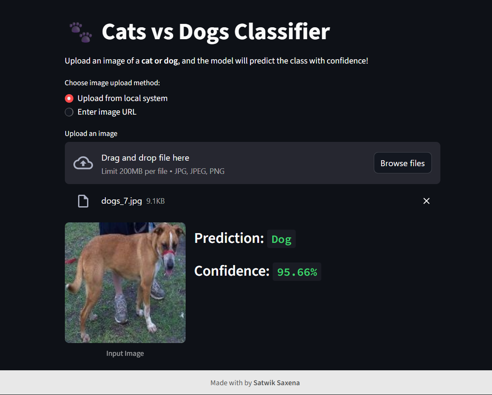

# 🐾 Cats vs Dogs Image Classifier

This project is a simple and interactive web application built using **Streamlit** that classifies uploaded images as either **Cat** or **Dog** using a pre-trained deep learning model.

## 📌 Project Overview

- **Goal**: Predict whether an uploaded image is a cat or a dog.
- **Model Used**: A Convolutional Neural Network (CNN) trained on a labeled dataset of cat and dog images.
- **Frontend**: Built using Streamlit for a clean and user-friendly interface.
- **Backend**: Utilizes TensorFlow/Keras for model loading and image classification.

## 🚀 Features

- Upload image from local system or provide an online image URL.
- Real-time prediction with confidence score.
- Clean, responsive UI with custom CSS styling.
- Graphical confidence score (optional to extend).
- Caching enabled for model loading to improve performance.

## 📂 File Structure

- `app2.py`: Main Streamlit app file to run the web application.
- `cats_vs_dogs.keras`: Trained CNN model saved in Keras format.
- `README.md`: Project documentation and instructions.
- `requirements.txt`: Python packages required to run the app.

## 🖼️ How It Works

1. User uploads an image or pastes an image URL.
2. Image is resized to 150x150 pixels and normalized.
3. The model predicts if it's a cat or a dog.
4. The result and confidence score are displayed.

## 📥 Setup Instructions

1. **Clone the repository**:
    ```bash
    git clone https://github.com/yourusername/cats-vs-dogs-classifier.git
    cd cats-vs-dogs-classifier
    ```

2. **Install dependencies**:
    ```bash
    pip install -r requirements.txt
    ```

3. **Run the Streamlit app**:
    ```bash
    streamlit run app2.py
    ```

## 🧪 Requirements

- Python 3.7+
- Streamlit
- TensorFlow
- Pillow
- NumPy
- Plotly

> Install them using: `pip install streamlit tensorflow pillow numpy plotly`

## 🧠 Model Details

- Input Size: 150x150 RGB images
- Architecture: CNN with Conv2D, MaxPooling, BatchNormalization, Dense layers
- Output: Binary classification (`0 = Cat`, `1 = Dog`)
- Training Dataset: Based on Kaggle Dogs vs. Cats Dataset

## ✨ Example



## 🙌 Acknowledgments

- [Kaggle Dogs vs. Cats Dataset](https://www.kaggle.com/c/dogs-vs-cats/data)
- [Keras Documentation](https://keras.io/)
- [Streamlit Docs](https://docs.streamlit.io/)

---

👨‍💻 **Made with ❤️ by Satwik Saxena**

